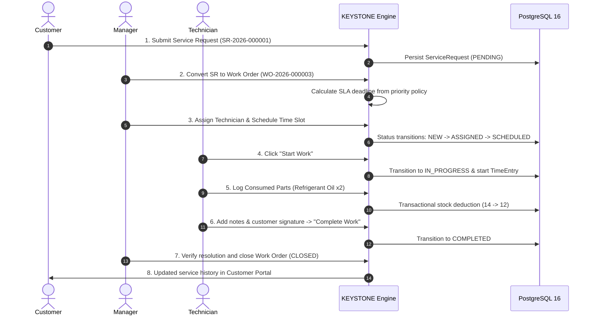

# KEYSTONE — Enterprise Field Service Command & Operations Platform


**KEYSTONE** is an enterprise-grade, multi-tenant **Field Service Management (FSM)** platform built to orchestrate work orders, field technician dispatch, equipment asset tracking, transactional parts inventory, and SLA-driven operations with real-time intelligence.

---

## 🌟 Key Capabilities

### ⚡ Operations & Dispatch Command
- **Strict Work Order State Machine**: Enforces sequential lifecycle transitions (`NEW` ➔ `ASSIGNED` ➔ `SCHEDULED` ➔ `IN_PROGRESS` ➔ `COMPLETED` ➔ `CLOSED`) with full audit history.
- **Sequential Work Order Numbers**: System-generated order identifiers (`WO-2026-000001`).
- **Technician Dispatch & Overlap Prevention**: Intelligent conflict detection prevents double-booking technicians during identical scheduling windows.

### ⏱️ SLA Intelligence & Automated Engine
- **Priority-Driven Policies**:
  - `CRITICAL`: 2-Hour Resolution Window
  - `HIGH`: 4-Hour Resolution Window
  - `MEDIUM`: 24-Hour Resolution Window
  - `LOW`: 48-Hour Resolution Window
- **Automated Background Scanner**: Scheduled daemon (`SlaCheckScheduler.java`) scans active work orders every 60 seconds to detect near-breach conditions (`AT_RISK`) and issue real-time breach notifications.
- **Operations Pulse Dashboard**: Real-time SLA health distribution and operational velocity trends.

### 📱 Multi-Role Portals & Custom Workspaces
- **Technician Mobile Workspace**: Mobile-optimized field interface with job queue, one-click time tracking, parts logging, photo uploads, and signature sign-off.
- **Customer Self-Service Portal**: Asset registry, real-time ticket tracking, and direct Service Request creation (`SR-2026-000001`).
- **Manager Dispatch Board**: Calendar scheduling, one-click Service Request conversion to Work Orders, and team dispatching.
- **Admin Operations Center**: Multi-tenant metrics, role management, part inventory catalogs, and SLA policy configuration.

### 🛡️ Enterprise Architecture & Security
- **Stateless JWT Security**: HMAC-SHA512 token verification with BCrypt password hashing (strength 10).
- **Strict Multi-Tenancy**: Organization tenant isolation enforced across all database queries and JPA repositories.
- **Transactional Stock Deduction**: Parts used by technicians on a work order atomically decrement inventory stock with automated low-stock warnings.

---

## 🏗️ System Architecture

```mermaid
graph TD
    Client[Browser / Mobile Client] -->|React 19 + TanStack Router| Frontend[Frontend UI & Design System]
    Frontend -->|JWT Bearer / REST API| Security[Spring Security & JWT Auth Filter]
    Security -->|Tenant & Role Claims| Controllers[REST API Controllers]
    Controllers -->|DTO Validation| Services[Service & Engine Layer]
    Services -->|Lifecycle Engine| SM[Work Order State Machine]
    Services -->|Cron Job (60s)| SLA[SLA Policy Scheduler]
    Services -->|Spring Data JPA| Repositories[JPA Repositories]
    Repositories -->|JDBC / Flyway| Database[(PostgreSQL 16 Multi-Tenant Database)]
```

---

## 🔄 End-to-End Operational Lifecycle



---

## 🛠️ Technology Stack

| Layer | Technologies |
| :--- | :--- |
| **Frontend** | React 19, TypeScript 5.8, TanStack Start & Router, TanStack Query, Tailwind CSS v4, Lucide Icons, Recharts, Sonner Toasts |
| **Backend** | Java 21, Spring Boot 3.3.4, Spring Security, Spring Data JPA, JWT (`jjwt 0.12.6`), MapStruct, Lombok |
| **Database** | PostgreSQL 16, Flyway Database Migrations (`V1` to `V17`) |
| **Containerization** | Docker, Multi-Stage `Dockerfile`, Docker Compose |
| **API Documentation** | OpenAPI 3.0 / Swagger UI (`springdoc-openapi-starter-webmvc-ui 2.6.0`) |

---

## 🚀 Quick Start Guide

### Option 1: Complete Stack via Docker (Recommended)

```bash
# 1. Clone the repository
git clone https://github.com/keystone-fsm/keystone.git
cd keystone

# 2. Configure environment variables
cp .env.example .env

# 3. Start PostgreSQL 16 & Spring Boot Backend
docker compose up -d --build

# 4. Start React Frontend
npm install
npm run dev
```

- **Frontend Application**: [http://localhost:5173](http://localhost:5173)
- **Interactive Swagger UI**: [http://localhost:8080/swagger-ui.html](http://localhost:8080/swagger-ui.html)
- **Backend Health Endpoint**: [http://localhost:8080/actuator/health](http://localhost:8080/actuator/health)

---

### Option 2: Local Development Setup

#### Backend:
1. Ensure **PostgreSQL 16** is running on port `5432` with database `keystone_db`.
2. Launch Spring Boot:
   ```bash
   cd backend
   ./mvnw spring-boot:run
   ```

#### Frontend:
```bash
npm install
npm run dev
```

---

## 🔑 Pre-Seeded Demo Accounts (Evaluator Logins)

> **Universal Password for all accounts**: `Keystone@2026!`

| Role | Email | Target Workspace | Primary Responsibilities |
| :--- | :--- | :--- | :--- |
| **Admin** | `admin@keystone.local` | Operations Command | System configuration, KPI analytics, SLA policy manager |
| **Manager** | `manager@keystone.local` | Dispatch Board | Work order triage, SR conversion, technician assignment |
| **Technician** | `technician@keystone.local` | Mobile Workspace | Field job execution, time logger, parts inventory consumption |
| **Customer** | `customer@keystone.local` | Self-Service Portal | Equipment directory, service ticket creation, repair tracking |

---

## 📂 Project Structure

```
KEYSTONE/
├── backend/                              # Spring Boot 3.3.4 Backend (Java 21)
│   ├── Dockerfile                        # Multi-stage container build
│   ├── pom.xml                           # Maven dependencies & plugins
│   └── src/
│       ├── main/java/com/keystone/
│       │   ├── security/ & auth/         # JWT filter, UserDetails & security config
│       │   ├── organization/             # Multi-tenant isolation model
│       │   ├── user/                     # User management & roles
│       │   ├── work_order/               # State machine, controller & services
│       │   ├── sla/                      # SLA engine & 60s background scheduler
│       │   ├── customer/ & technician/   # Customer & technician directories
│       │   ├── asset/                    # Equipment tracking
│       │   ├── inventory/                # Parts stock & transactional deduction
│       │   ├── time_tracking/            # Labor timers & time entry records
│       │   ├── service_request/          # Customer SRs & conversion logic
│       │   ├── notification/             # Notification dispatch engine
│       │   ├── activity_log/             # Audit logs & compliance trail
│       │   └── dashboard/ & report/      # Operations & executive aggregation
│       └── main/resources/
│           ├── application.yml           # Database, security & CORS configuration
│           └── db/migration/             # 17 Flyway SQL migrations (V1 to V17)
├── src/                                  # React 19 Frontend
│   ├── api/                              # REST API Client (Fetch + JWT Interceptor)
│   ├── components/                       # KEYSTONE UI Components & Design System
│   │   ├── keystone/                     # Workspace modules & application shells
│   │   └── ui/                           # Radix UI primitives & design tokens
│   ├── data/                             # Mock fallback dataset
│   ├── routes/                           # TanStack Router File Routes
│   └── styles.css                        # Theme definitions & layout utilities
├── docs/                                 # Complete Technical Documentation Suite
├── scripts/                              # Developer setup & health check scripts
├── docker-compose.yml                    # Postgres 16 & Spring Boot stack
└── README.md
```

---

## 📚 Technical Documentation Suite

| Document | Purpose |
| :--- | :--- |
| 📐 [Architecture Specification](docs/ARCHITECTURE.md) | Deep architectural blueprint, component diagrams & data flows |
| 🔌 [REST API Manual](docs/API.md) | Complete REST API endpoint catalog, headers, and payloads |
| 🗄️ [Database Schema & ERD](docs/DATABASE.md) | PostgreSQL schema, ER diagrams & 17 Flyway migrations |
| 🔐 [Security & Role Model](docs/SECURITY.md) | JWT auth specifications, tenant isolation & RBAC matrix |
| ⚙️ [Work Order State Machine](docs/WORK_ORDER_LIFECYCLE.md) | State transition validation rules & terminal states |
| ⏱️ [SLA Engine Architecture](docs/SLA_ENGINE.md) | Policy resolution windows, background scheduler & alerts |
| 📦 [Inventory Management](docs/INVENTORY.md) | Stock deduction rules, transaction safety & thresholds |
| 👥 [User Roles & Portals](docs/USER_ROLES.md) | Detailed feature access matrix across all 4 roles |
| 🛠️ [Developer Setup Guide](docs/DEVELOPMENT.md) | Setup instructions for local development |
| 🚀 [Production Deployment](docs/DEPLOYMENT.md) | Production Docker, cloud & security best practices |
| 📋 [Project Submission Document](docs/SUBMISSION.md) | Executive project summary and evaluation deliverables |
| 🎙️ [5-Minute Live Demo Script](docs/DEMO_SCRIPT.md) | Step-by-step evaluator walkthrough script |

---

## 📄 License

This project is licensed under the **MIT License** — see the [LICENSE](LICENSE) file for details.
