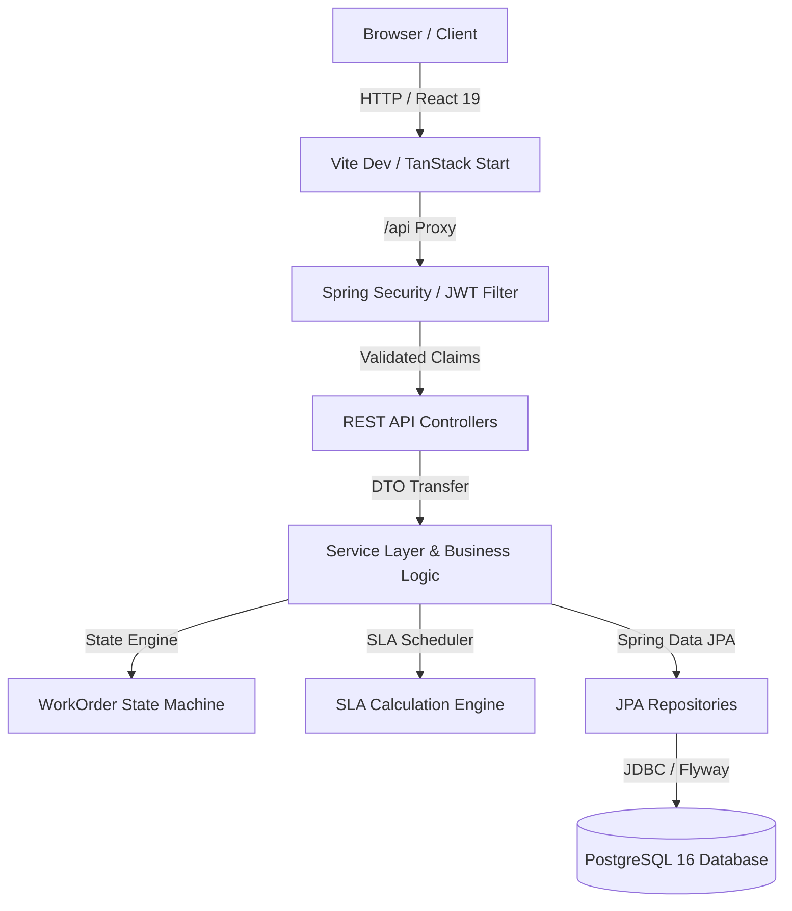
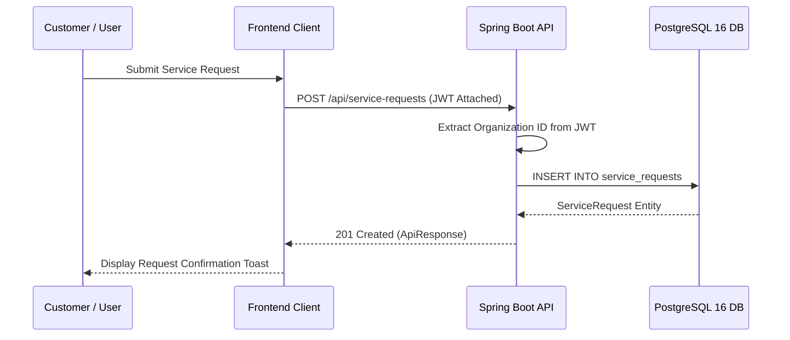

# KEYSTONE Architecture Specification

## System Architecture

KEYSTONE is designed as an enterprise-grade multi-tenant Field Service Management platform using a modern decoupled architecture.

---

## Technical Stack Overview

### Frontend Architecture
- **Framework**: React 19 + TanStack Start & Router
- **Styling**: Tailwind CSS v4 + Vanilla CSS Design System
- **HTTP Layer**: Native `fetch` with centralized JWT Bearer interceptor (`src/api/client.ts`)
- **State Management**: TanStack Query + React Hooks

### Backend Architecture
- **Framework**: Spring Boot 3.3.4 (Java 21)
- **Security Layer**: Stateless JWT (`jsonwebtoken 0.12.6`), BCrypt Password Encoding
- **Multitenancy**: Organization isolation via tenant ID filtering on all entity repositories
- **Database Migrations**: Flyway SQL migrations (`V1` through `V17`)
- **API Specification**: OpenAPI 3.0 / Swagger UI (`springdoc-openapi-starter-webmvc-ui 2.6.0`)

---

## Data Flow Lifecycle

