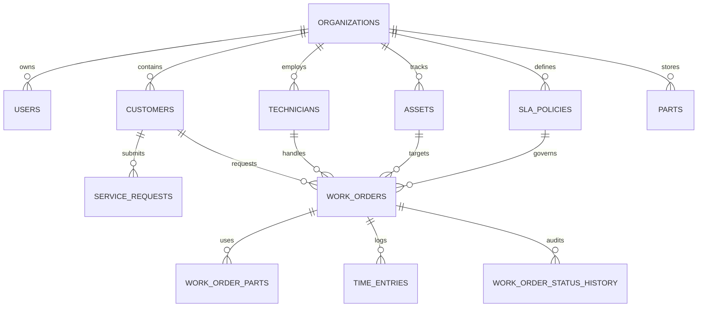

# KEYSTONE Database Schema Specification

## Entity Relationship Model

---

## Migration Catalog (Flyway SQL)

| Migration | Filename | Purpose |
| :--- | :--- | :--- |
| `V1` | `V1__create_organizations.sql` | Tenant isolation base table |
| `V2` | `V2__create_users.sql` | Authentication & user roles table |
| `V3` | `V3__create_customers.sql` | Customer company directory table |
| `V4` | `V4__create_technicians.sql` | Field technician profile & GPS table |
| `V5` | `V5__create_technician_skills.sql` | Technician skill matrix table |
| `V6` | `V6__create_assets.sql` | Customer asset tracking table |
| `V7` | `V7__create_sla_policies.sql` | SLA policy threshold table |
| `V8` | `V8__create_work_orders.sql` | Core Work Order table |
| `V9` | `V9__create_work_order_history.sql` | Status transition audit history table |
| `V10` | `V10__create_service_requests.sql` | Customer self-service request table |
| `V11` | `V11__create_parts.sql` | Parts inventory stock table |
| `V12` | `V12__create_work_order_parts.sql` | Work Order part usage line items |
| `V13` | `V13__create_time_entries.sql` | Technician billable time log table |
| `V14` | `V14__create_notifications.sql` | In-app user notifications table |
| `V15` | `V15__create_activity_logs.sql` | System audit log table |
| `V16` | `V16__create_attachments.sql` | File attachment metadata table |
| `V17` | `V17__seed_data.sql` | Pre-seeded Northstar Operations dataset |
